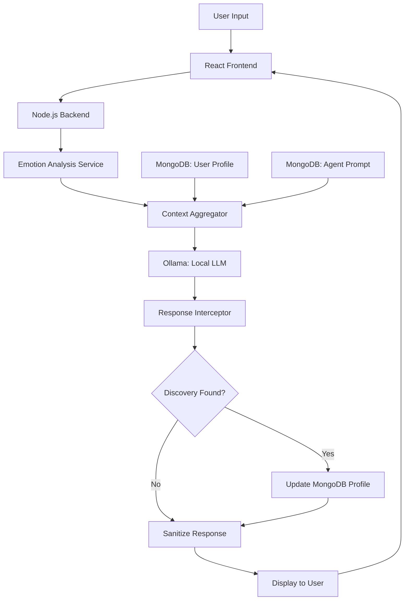
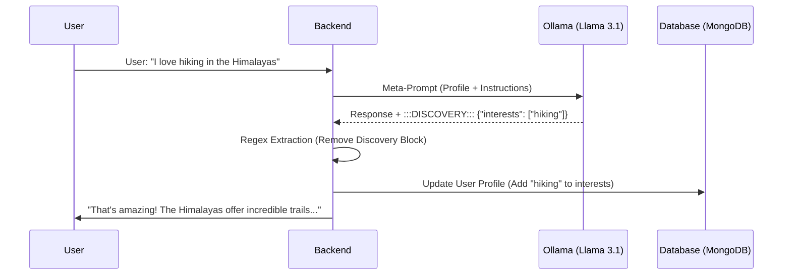

# Project Synopsis: Multi-Personalized AI Agent Platform (DMSM CCA)

## 0. PROJECT BRIEF
**DMSM CCA** is a specialized, privacy-first AI companion designed to bridge the social gap for introverts and those who find traditional human interaction taxing. Unlike generic, transactional chatbots, this platform uses persistent **Personal Behavioral Prompts** to maintain a consistent, evolving personality that remembers user traits and adapts its emotional tone. It offers a safe, local-only space for deep conversation without the fatigue or judgment of social interactions.

## 1. INTRODUCTION / BACKGROUND
The integration of Artificial Intelligence into daily life has evolved from simple command-response systems to sophisticated digital companions. However, most contemporary AI agents remain transactional, lacking the emotional depth and personal continuity required for true human-centric interaction. This project introduces **DMSM CCA**, a next-generation AI platform designed to bridge this gap. By combining real-time emotional intelligence with a proactive "Self-Discovery" engine, the platform creates agents that don't just respond but evolve alongside the user, fostering a more natural and empathetic digital relationship.

## 2. PROBLEM STATEMENT
Current AI interfaces suffer from four primary limitations:
1.  **Transactional Nature**: Most bots treat every interaction as an isolated event, failing to build a long-term understanding of the user's personality or preferences.
2.  **Lack of Behavioral Continuity**: Standard chatbots do not have "personal behavior prompts"—they lack a consistent persona that "remembers" how to interact specifically with you.
3.  **Social Fatigue for Introverts**: Many individuals (introverts/introverts) find traditional social cues and judgments overwhelming. Generic AI remains too "clinical" or "form-based" to provide a comfortable social proxy.
4.  **Privacy Concerns**: Reliance on cloud-based LLM providers requires users to send sensitive personal data to external servers, creating significant privacy risks.

## 3. OBJECTIVES OF THE PROJECT / Requirements
The core objectives of the DMSM CCA platform are:
-   **EQ-Driven Interaction**: Implement real-time emotion detection to dynamically adjust the AI's tone, temperature, and verbosity.
-   **Continuous Evolution**: Develop a "Self-Discovery" mechanism that autonomously extracts and stores user traits from natural conversation.
-   **Persona Specialization**: Provide a diverse ecosystem of agents (e.g., Code Mentor, Emotional Support) with distinct behavioral guidelines.
-   **Local Sovereignty**: Ensure 100% data privacy by executing all AI inference locally using the Ollama framework.
-   **Aesthetic Excellence**: Deliver a premium, responsive UI that uses glassmorphism and micro-animations to create an immersive "living" interface.

## 4. SCOPE OF THE PROJECT
The scope involves the development of a full-stack web application featuring:
-   **Multi-Agent Backend**: A Node.js/Express server managing specialized system prompts and user session state.
-   **Local AI Inference**: Integration with Ollama for running high-parameter models (like Llama 3.1) locally.
-   **Profile-Driven Memory**: A MongoDB-backed system that stores evolving user profiles and conversation histories.
-   **Emotion-Aware Frontend**: A React-based UI that visually reflects the interaction state and provides seamless agent switching.

## 5. Existing system
Traditional AI systems typically rely on:
-   **Cloud APIs**: Heavy dependence on internet connectivity and third-party API availability.
-   **Fixed Personalities**: Bots that require manual configuration of "memory" or "preferences" through static forms rather than learning through interaction.
-   **Standard UI Patterns**: Row-based, static chat interfaces that lack the dynamic visual feedback of modern premium applications.

## 6. PROPOSED SYSTEM
The proposed system architecture is designed for modularity and privacy. It follows a loop-based interaction model:

### 6.1 System Architecture Flow

### 6.2 The Self-Discovery Loop (Technical View)

### 6.3 Detailed Flow Description
1.  **Ingestion**: User input is captured via the React frontend.
2.  **Analysis**: The backend `emotion.service` analyzes the text for psychological resonance.
3.  **Context Construction**: The `chat.controller` retrieves the User Profile and Agent System Prompt, merging them into a high-context "Meta-Prompt."
4.  **Local Inference**: The Meta-Prompt is sent to `Ollama (Llama 3.1)` for processing.
5.  **Self-Discovery Extraction**: The system intercepts the AI's response, extracting hidden `:::DISCOVERY:::` blocks via regex to update the User Profile in MongoDB.
6.  **Responsive UI Update**: The sanitized response is delivered to the user, with UI elements reflecting the detected emotional state.

### Input and Outputs
-   **Input**: Natural language text, selected AI agent, and user-defined response length preferences.
-   **Output**: Persona-consistent AI responses, real-time emotion telemetry, and updated user personality traits.

## 7. HARDWARE REQUIREMENTS and SOFTWARE REQUIREMENTS

### Hardware Requirements
-   **Processor**: 8-core CPU (Intel i7/AMD Ryzen 7 or better).
-   **RAM**: Minimum 16GB (32GB recommended for Llama 3.1 8B+ models).
-   **GPU**: 8GB+ VRAM (NVIDIA RTX 30-series or higher recommended for high-speed inference).
-   **Storage**: 500MB for application + 5GB-10GB per local LLM model.

### Software Requirements
-   **Runtime**: Node.js (v18+), npm/yarn.
-   **Database**: MongoDB (Local or Atlas).
-   **AI Engine**: Ollama (Windows/MacOS/Linux).
-   **Frontend**: React.js with Vite.
-   **Core Libraries**: Express, Mongoose, Axios, Lucide-React.

## 8. EXPECTED OUTCOMES
-   **Enhanced User Engagement**: Users experience a sense of growth as agents "remember" and reference personal details naturally.
-   **Zero-Data Leakage**: Sensitive conversations remain on the user's local hardware.
-   **Modular Scalability**: Ability to easily add new agents or switch models as local AI technology advances.

## 9. Limitations / Future Scopes
### Limitations
-   **Keyword Emotion Detection**: Currently uses a keyword-based approach which may miss context-heavy sarcasm or complex emotions.
-   **Hardware Dependency**: Performance is strictly tied to the host machine's processing power.

### Future Scopes
-   **Advanced Emotion AI**: Integrating `Transformers` for deep semantic emotion analysis.
-   **Voice Integration**: Real-time STT (Speech-to-Text) and TTS (Text-to-Speech) for hands-free interaction.
-   **Multi-Modal Support**: Ability for agents to analyze images and documents locally.

## 10. REFERENCES
1.  **Ollama Documentation**: [ollama.ai/docs](https://ollama.com/library)
2.  **React Documentation**: [react.dev](https://react.dev)
3.  **Llama 3.1 Model Card**: Meta AI Research.
4.  **Human-Centered AI Design Patterns**: Various academic and industry best practices.
